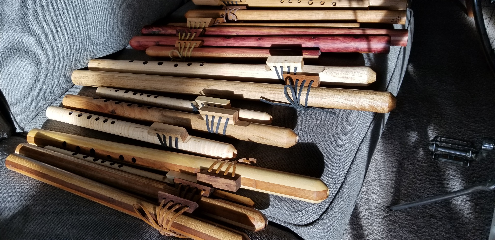

# Flutes — Engineering Documentation for Native American Style Wooden Flutes

> *50+ Native American style wooden flutes built between roughly 2018 and 2021, plus the parametric design table that produced them and the build registry that tracked them.*


*(placeholder — drop in a finished-instrument photo or a fan-out of multiple flutes)*

## What this is

Engineering documentation for a multi-year personal practice of building **Native American style flutes** — a two-chambered, end-blown, fipple-class wooden flute tuned to the pentatonic minor scale, traditionally associated with the music of various Indigenous peoples of North America.

This repository combines four threads:

1. **A parametric design table** ([`design-table/flute-dimensions-parametric.xlsx`](design-table/flute-dimensions-parametric.xlsx)) covering flutes from **G3 to A4** (and beyond), with formulas that derive every build dimension — bore ID, wall thickness, hole positions, hole diameters, blank dimensions, board feet of wood — from a single input: the target fundamental note. Built around the canonical NAF pentatonic-minor hole spacing (3-2-2-3-2 semitones).
2. **A build registry** of **50+ serial-numbered flutes** I've made, recording wood species, key, dimensional measurements, failure modes, and final build status.
3. **CAD geometry** for the body, the slow-air chamber, the nest, the bird/fetish block, and the cutting jigs.
4. **Lineage:** the build methodology was learned from the **[Blue Bear Flutes](https://www.youtube.com/@bluebearflutes)** YouTube channel and developed forward from there into a parametric system.

Sister project to [`djembe`](https://github.com/tonykoop/djembe), [`dundun`](https://github.com/tonykoop/dundun), [`didgeridoo`](https://github.com/tonykoop/didgeridoo), and [`ashiko-drum-workshop`](https://github.com/tonykoop/ashiko-drum-workshop).

## Cultural attribution

Native American flutes hold deep spiritual and cultural significance in many Indigenous communities of North America, with traditional roles in courtship, ceremony, healing, and storytelling. As a non-Indigenous maker, the instruments I build are more accurately termed **"Native American style flutes"** (sometimes NAF or NASF) — instruments inspired by, learned in dialogue with, and built in respect for the tradition, but not part of it. The methods documented here are publicly-available craft and engineering knowledge passed forward from contemporary makers to me; the deeper cultural practice belongs to the Indigenous communities from whom the instrument originates.

## Background — what makes a Native American flute different

A Native American flute is **two acoustic chambers in series** with an external block on top:

- **Slow Air Chamber (SAC)** — the short upper chamber. Player blows into the mouthpiece; air enters the SAC and is rerouted up through a small flue, across the open top of the body, and into the True Sound Hole.
- **Bird / Fetish Block** — a removable wooden block sitting on top of the flute, often carved into a totemic shape. Its underside has a precisely-cut channel that directs the air across the True Sound Hole at the right angle and speed to excite the playing chamber.
- **Long (Playing) Chamber** — the main body of the flute, with six finger holes drilled at calculated positions to produce the pentatonic minor scale.

The split-chamber design is what distinguishes the NAF from a Western fipple flute (recorder, tin whistle), where the fipple is integrated into the headjoint. The NAF's external block lets the maker tune the flute's voicing by adjusting the block's position, the flue dimensions, and the angle of the cut into the True Sound Hole — all without disturbing the body. This is also what makes the NAF an extraordinarily sensitive instrument to engineer correctly: small geometry changes shift the tuning audibly.

## The parametric design table

The single most engineering-heavy artifact in this repository is the parametric design table — a spreadsheet that takes a target fundamental note as input and computes every dimension required to build a flute that plays in tune. Inputs are listed in column A, calculated/tabulated values in column G:

**User-set variables (per key):**

| Var | Meaning |
|---|---|
| A | Mouthpiece length |
| B | Short chamber length (the SAC) |
| C | Spacing length (between SAC and playing chamber) |
| E | Extra length to fit lathe chuck jaws |
| F | Bore inner diameter |
| G | Mouthpiece diameter |
| N–S | Hole diameters (six finger holes) |
| T | Wall thickness (~ 1/3 of bore ID) |
| U | Flue depth (~ 0.035" across all keys) |
| V | Flue width (~ 1/2 of bore ID) |
| W | Sound hole length |

**Calculated/derived (per key, formula-driven):**

- Blank length, blank width, blank thickness — total wood requirements
- Turned diameter — finished outside surface
- Board feet of wood — material cost
- Nest distance from mouthpiece — where the bird/fetish block sits
- Sunken nest depth + width — to keep the bird flush with the body
- Hole positions (six holes) — distance from foot end of flute, computed from acoustic relationships

**Tuning:** the design assumes a **pentatonic minor scale** with the standard NAF semitone pattern of **3-2-2-3-2** above the fundamental. The hole frequencies are computed from `f = 440 × 2^((n-49)/12)` where `n` is the piano key number — chromatic equal temperament referenced to A4 = 440 Hz.

Both `CNC Flute Dimensions` (designed for CNC-machined blanks, very precise) and `Low to High Range` (broader range, hand-builder friendly) sheets live in the workbook and produce slightly different geometry trade-offs.

## The build registry

The `Built` sheet of the workbook tracks every flute I've made by serial number. Engineering columns include: number, wood species, key, true-sound-hole width (TSH), track length, nest width, fetish requirement, finished long chamber length, hole pattern reference, date glued, date routered. Customer and gift-recipient information is kept private and is not included in the public version of this registry.

Patterns from the registry as of last update:

- **~50+ flutes** documented across the build sheet (numbers 001 through ~050 with extensions beyond).
- **Wood species** explored: White Oak, Pine, Mahogany, Hard Maple, Western Red Cedar, Black Walnut, Brazilian Walnut, Ambrosia Maple, Birch, Poplar, Oak.
- **Keys** covered: F4, Gb4, G4, Ab4, A4, Bb4, B4, C5, Db5, D5, Eb5, E5 — most of the playable middle range.
- **Failure modes** logged honestly: *"Death on the Router," "Exploded on the lathe, bark inclusion," "Failed Quality Control," "TSH too big," "cut into signature."* Engineering yield was a real consideration; the registry is what let me see which wood/key combinations were durable and which weren't.
- **Dispositions** ranged from gifts to art-fair sales to in-stock inventory and learning-experience builds — recipient details are kept private.

## Engineering challenges this repository documents

**1. Two-chamber acoustic tuning.** Unlike a single-chamber instrument (didgeridoo, recorder), the NAF has air paths that interact in the SAC → flue → TSH → playing-chamber sequence. The fundamental of the playing chamber depends on the Long Chamber's effective length, but the playing *response* (how much breath pressure produces clean tone) depends on the SAC, flue, and block geometry. The parametric table captures the dimensional rules; the build registry captures what worked.

**2. Wood-species variation.** The same dimensional spec produces audibly different tone in cedar, walnut, and maple. The registry's `Wood Species` and `Notes` columns let me track which species were forgiving (cedar — very) and which were unforgiving (hard maple — yes; ambrosia maple — also unforgiving, with a high failure rate noted in the registry).

**3. Yield management.** The registry's failure-mode entries are an honest record of how often a flute didn't survive the build. Lathe explosions and routing accidents were not rare. Building a parametric design table didn't reduce yield to 100%; it *bounded* the tolerance window, made each failure diagnosable, and let me iterate the table by what failed.

## CAD and jig design

> *(Forthcoming — pulling SolidWorks files for the body, nest, fetish block, and routing jigs into `/CAD/` as I get SolidWorks running again.)*

Repository structure is laid out for:

- `/CAD/flute-body/` — the body geometry parametric in target key.
- `/CAD/nest-and-fetish/` — the sunken nest where the bird/fetish block sits, and the block geometry itself (with the air-direction channel underneath).
- `/CAD/jigs/` — the routing fixture for cutting the SAC and TSH, and any sanding or hole-drilling jigs.

## Lineage and acknowledgments

The build methodology in this repository was learned primarily from the **[Blue Bear Flutes](https://www.youtube.com/@bluebearflutes)** YouTube channel — an extraordinary public archive of craft knowledge from a contemporary maker generously sharing technique. The parametric design table and the engineering documentation are my own derivations from that learning process; the underlying craft is not.

## What this work is for

- **The engineering question** — does a parametric design table let you reliably build flutes in tune across multiple wood species and a wide key range? The build registry says: yes, *bounded by* yield. Improving the table's predictions is the iterative loop the table itself enables.
- **The portfolio frame** — for engineers and recruiters: this repository documents an ongoing engineering-grade craft practice. The parametric table is a working SolidWorks-adjacent design tool; the build registry is the production data that validated it; the failure-mode column is the honest engineering-yield record. All from one personal practice spanning ~3+ years.
- **The personal frame** — these flutes have been gifts, art-fair sales, family heirlooms, and personal instruments. The people who received them are not named in this repository.

## License

Released under [CC-BY 4.0](LICENSE) — use freely with attribution. The Native American flute originates with Indigenous peoples of North America and remains culturally significant; the engineering documentation, parametric design table, build registry, and analysis in this repository are my own work, free to reuse and adapt with credit. The Blue Bear Flutes lineage is acknowledged above and any derivative work should reference that source as well.

## Repository structure

```
flutes/
├── README.md                  ← you are here
├── LICENSE                    ← CC-BY 4.0
├── .gitignore
├── design-table/
│   └── flute-dimensions-parametric.xlsx   ← the engineering core
├── built-log/
│   └── (extracts from the Built sheet — flute build registry)
├── research/                  ← Blue Bear Flutes references, NAF acoustic notes
├── analysis/                  ← derived charts, yield analysis (forthcoming)
├── CAD/
│   ├── flute-body/            ← body geometry parametric in key
│   ├── nest-and-fetish/       ← sunken nest + bird/fetish block geometry
│   └── jigs/                  ← routing fixture, hole-drilling jigs
├── drawings/                  ← PDF exports of hole patterns + body sections
├── images/                    ← finished-flute photos, build photos, fetish detail shots
└── reference/                 ← scale/temperament references, NAF community resources
```

## Status

| Section | Status |
|---|---|
| Repo description, license, gitignore | ✓ done |
| Parametric design table | ✓ committed (the engineering core) |
| Build registry summary | ✓ summarized in this README |
| Hero photos | forthcoming |
| Cultural attribution | ✓ done |
| CAD — body geometry | not yet committed (SolidWorks access pending) |
| CAD — nest + fetish | not yet committed |
| CAD — jigs | not yet committed |
| Yield analysis from build registry | forthcoming |

A repository in motion, not a finished portfolio piece — but with the most empirical data of any of my instrument repositories.
